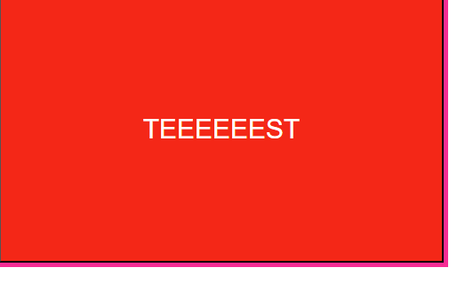
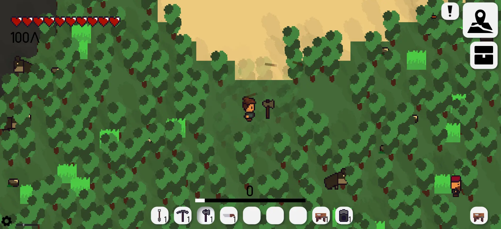
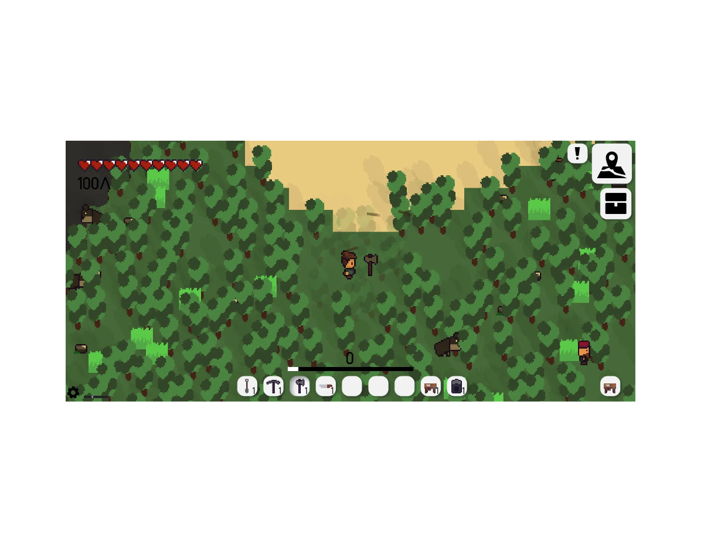
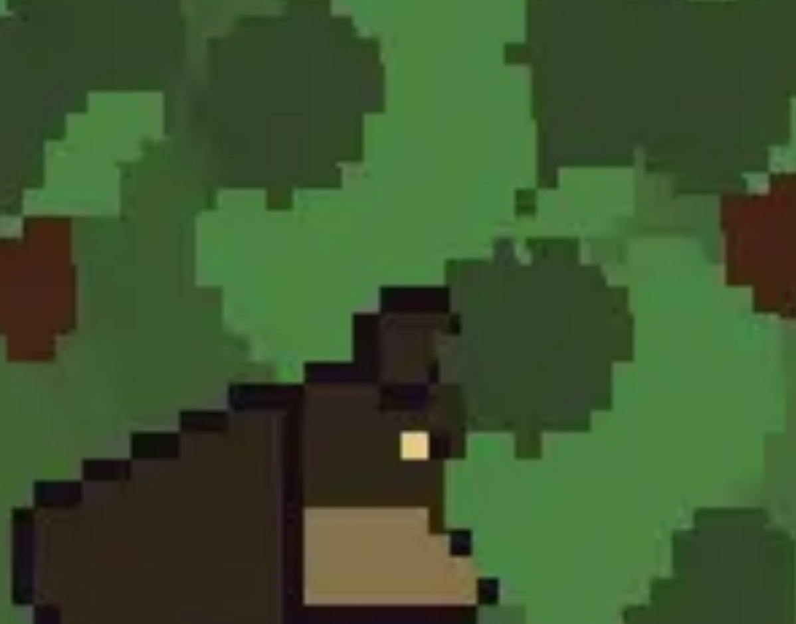
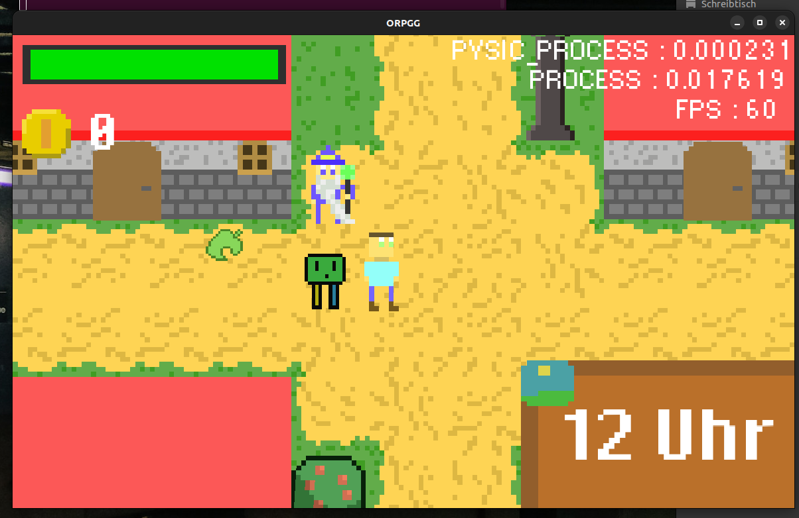

# https://zoomanyjs.benherbst.net/
<div align="center">
<h1>ZoomAny.js</h1>


Zoom literally **ANY** HTML Element using pure vanilla JavaScript.

_\*Supports TypeScript_
</div>

## Features
- TypeScript support
- Uses relative and not absolute position ( keep same place, just make zoomable )
- Enable zoom for any HTML Element you want, not just images
- Boundings
- Fully controlable via functions and data-* attributes

## Install

Install via NPM:
```
npm i zoom-any-js
```

Or via CDN:
```
CSS: https://cdn.jsdelivr.net/npm/zoom-any-js@latest/dist/zoom-any-js.css
JS: https://cdn.jsdelivr.net/npm/zoom-any-js@latest/dist/zoom-any-js.js
```

## Basic Usage

To get started, add the class "zoomable" to the element you want to enable zoom on:
``` html

```

### NPM + Bundler:
Then create a new instance in JavaScript, and import the CSS:
``` javascript
import ZoomAnyJs from "zoom-any-js";
import "zoom-any-js/dist/zoom-any-js.css";

const zoom = new ZoomAnyJs()
```

### CDN:
``` html
<link type="text/css" rel="stylesheet" href="https://cdn.jsdelivr.net/npm/zoom-any-js@latest/dist/zoom-any-js.css">
```

``` html
<script type="module">
    import ZoomAnyJs from "https://cdn.jsdelivr.net/npm/zoom-any-js@latest/dist/zoom-any-js.js"

    const zoom = new ZoomAnyJs()
</script>
```

Now try to zoom into your image, it should start to zoom! 🎉

## Examples

Go to center on click:
``` ts
document.getElementById("img").addEventListener("click", () => {
    zoom.center()
    zoom.apply()
})
```

Zoom into the screen center:
``` js
zoom.zoomAt(1.1, { x: window.innerWidth / 2, y: window.innerHeight / 2 })
zoom.apply()
```

Using the wrapper class:
``` html
<div class="wrapper">
  <button class="zoomable" data-max-zoom="2000" data-min-zoom="20" data-bounds style="background-color: red; color: white; width: 500px; height: 300px; font-size: 30px;">TEEEEEEST</button>
</div>
```




This keeps it inside the wrapper div and makes you zoom into it without any overflow.

Whatsapp or Windows Photos like Image Zoom:
``` html

```





Multiple images:
Each gets their own instance, and you pass a css selector into the constructor like this:
``` js
const zoom1 = new ZoomAnyJs()
const zoom2 = new ZoomAnyJs(".zoom2")
const zoom3 = new ZoomAnyJs("#zoom3")




```

## Options

Basic options can be set by using data-* attributes on the element you zoom:

- data-max-zoom: Set maximimum zoom. Integer or "fit". Default: 4000
- data-min-zoom: Set minimum zoom. Integer or "fit". Default: 10
- data-bounds: Enable fit to bounding. Default: false
- data-origin-parent: Use the _offsetParent_ as origin for fitting bounding. Else it uses window. Default: false
- data-draggable: Enable dragging of the content within the wrapper/container. Default: false

_The default zoom level is 100, which is the original size and represents a scale of 1.0_

## Control via JavaScript

The instance, so in this case _const zoom_, has many functions which you can use to fully control the libary.

**You need to call .apply() to update the view to the changes!!!**

All available functions:
- center(): Moves the image to the center of the window or the offsetParent when using data-origin-parent
- fitToBounds(): Fits into the bounds when using data-bounds, else it just returns void
- zoomAt(amplitude: number, pos: {x: number, y: number}): Move to the position by the amplitude. Amplitude > 1 zooms in and amplitude < 1 zooms out
- zoomToFit(): set the zoom level such that the contents exactly fits within the parent/wrapper
- addListeners(): Adds the event listeners
- removeListeners(): Removes the event listeners
- apply(): Has to be callen to update the view. Without calling it, you cant see any change
- destroy(): Makes the element "normal" again, as before running the zoom library
- reset(): Resets position and zoom to default values
- getZoom(): Returns the zoom
- setZoom(value: number): Sets the zoom
- getPos(): Returns the position
- setPos(value: {x: number, y: number}): Sets the position
- isInteracting(): Return whether the person is currently interacting (zooming / dragging) with the content
